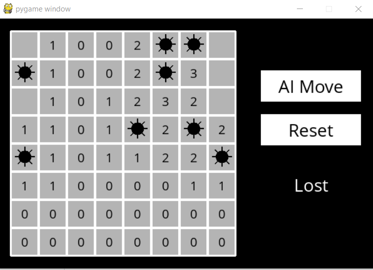

# CS50AI
Projects from CS50AI offered by Harvard
<ol>
  <li> <b>Knights : A game of Knights vs Knaves.</b> <ul><li>Objective: Knights always tell the truth and knaves always lie. Determine who is a knight and who isn't</li></ul>
  </li>
  <li> <b>Minesweeper: AN AI player for Minesweeper.</b><ul><li>Objective: Seek out all the mines on the playing board by clicking on all the 'safe' spots </li></ul>
      
    
Game WON! 

      
    
Game LOST! 

     
  </li>
  </ol>
