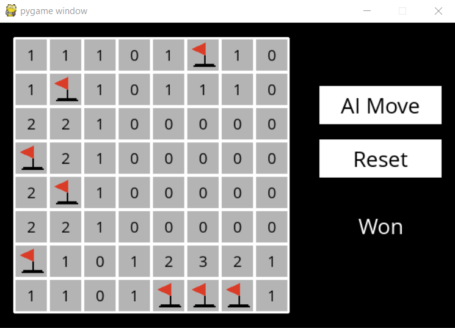
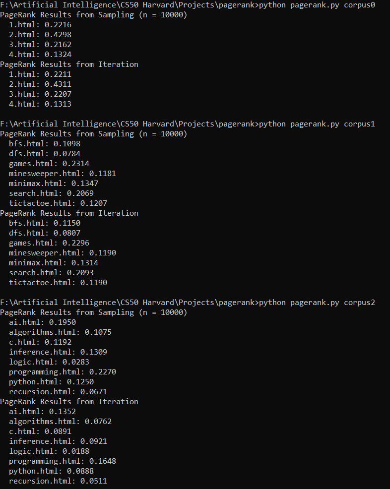
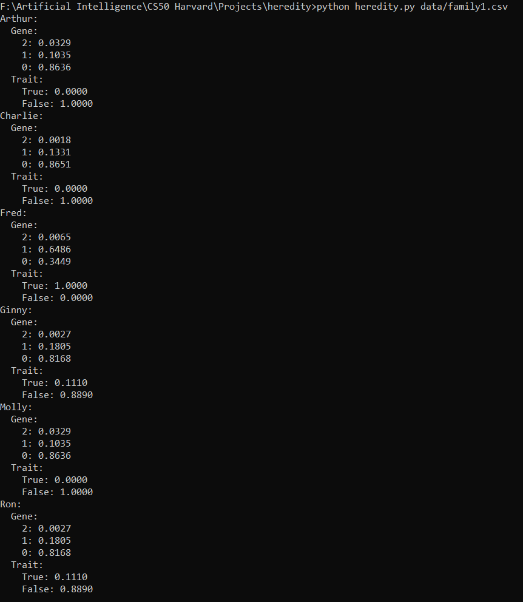

# CS50AI
Projects from CS50AI offered by Harvard

  <h2><u>Knights</u> : A game of Knights vs Knaves.</h2> <ul><li>Objective: Knights always tell the truth and knaves always lie. Determine who is    a knight and who isn't</li></ul>

  <h2><u>Minesweeper</u>: AN AI player for Minesweeper.</h2><ul><li>Objective: Seek out all the mines on the playing board by clicking on all the    'safe' spots </li></ul>
      
    
Game WON! 

     

  <h2><u>PageRank</u>: An Algorithm to decide page importance</h2><ul><li>Objective: Use a Markov Chain to decide the importance of a page based on a corpus of interlinked webpages</li></ul>
    
  
Output for the three corpora given: 

   
 

 

 
 <h2><u>Heredity</u>: Determine Presence or Absence of a gene</h2><ul><li>Objective: Use Bayesian networks and Joint Probabilities to determine Presence or Absence of defective GJB2 gene in a person</li></ul>
    
  
Output for Family1: 

   
 

 

 
 <h2><u>Crossword</u>: Solve the Crossword using given words and Structure</h2><ul><li>Objective: Use BackTracking Algorithm to determine the solution to the crossword if present</li></ul>
    
  
Solved Crossword 1: 

   
 

 

 
  
