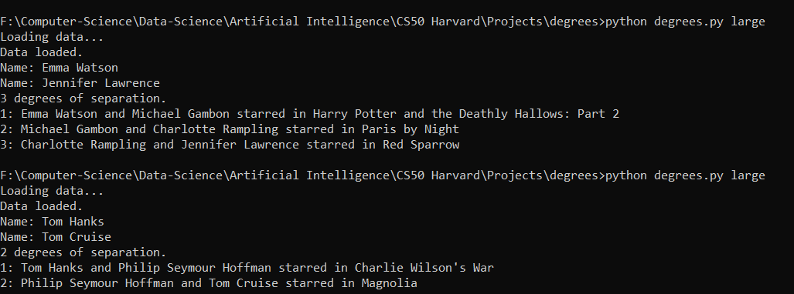
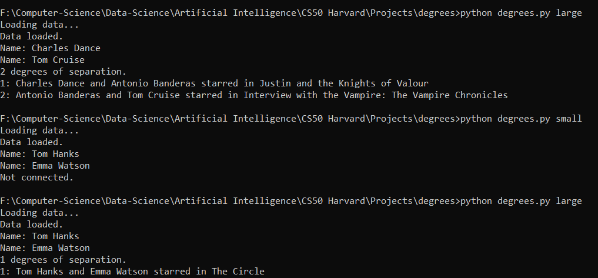

# Degrees

## Based on a statement that any actor in hollywood could be realted to Kevin Bacon within six steps.

## Implementation:

Uses a <b>Breadth First Search</b> to recursively check each movie (forming relationships between actors) until it arrives at the target.
  

<ul>
<li> <b>State:</b> The ID of the actor at the current node in the graph</li>
<li> <b>Parent:</b> The ID of the actor from which the agent arrived at the current node</li>
<li><b>Action:</b> The edge in the graph connecting parent and child. Represents a movie that both the actors starred in.</li>
<li><b>Node:</b> An object with the State, Parent and Action as its properties.</li>
<li><b>Frontier:</b> A Queue of Nodes waiting in order to be explored</li>
<li><b>Explored:</b> A set of already visisted nodes to that we dont visit them again and risk falling into an infinite loop</li>
</ul>

 

 

## Outputs:

