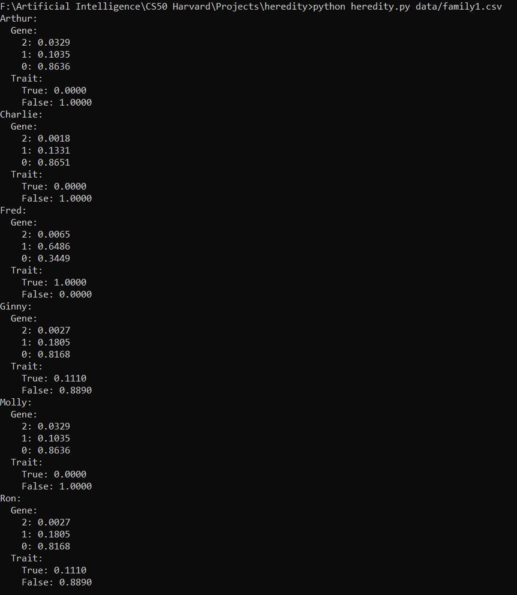

<h1>Heredity of GJB2 gene</h1>

This Algorithm uses a Bayesian Network to calculate the probability that a person has a particular defective gene given his/her family record of the same.
  
<b><u>Network:</u></b>  

  

A person may have 0,1 or 2 copies of this defective gene. Defective genes in a person are either <b>inherited</b> 
or are a result of <b>mutation</b>.
  
<b> Unconditional Occurence of Defective Genes are given by</b>  

  
<b> Conditional Probability relating Number of Defective Genes to Presence of traitt</b>  

  
<b> Inheritance of Defective Genes</b>  

<h2>Outputs</h2>
  
<b>Family 0</b>

  
<b>Family 1</b>

  
<b>Family 2</b>

