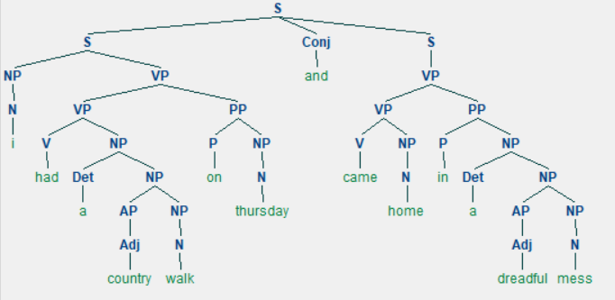
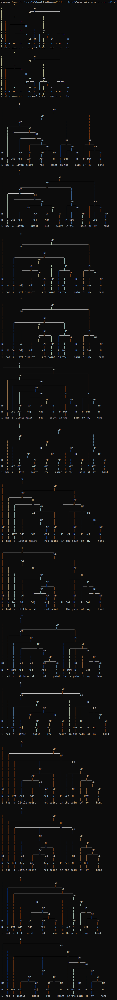

# Parser

### A tree Representation of an English sentence
<r>

## Method:

Each Sentence has a set of <b>Terminals</b> and <b>Non-Terminals</b>.
 
Terminals represent the vocabulary of the program i.e., what words the AI knows categorised as Nouns,Verbs,Adjectives etc.
 
Non-Terminals on the other hand tells the AI how a sentenve might be formed.
  For Example <b>S -> S Conj S | NP VP</b> says that a sentence can be two sentences joined by a conjunction or a combination
of a Noun Phrase and a Verb Phrase.
 

This program utilises the NLTK library to construct the trees from sentences.A set of Terminals and Non-Terminals are given to the model.
 
Each Sentence is converted into lowercase, stripped of any punctuations, split word-by-word and fed into the model.
 
The model then constructs a Tree based on the Non-Terminals provided.
 
Due to the ambiguity of natural language, a single sentence can be interpreted in multiple ways
according to structure and ence multiple trees can be drawn. NLTK is able to draw all such possible trees.

## Outputs:

 
NLTK also has the ability to reresent these trees in a more graphical manner.
 
For a Sentence: <b>I had a country walk on Thursday and came home in a dreadful mess.</b> 
 

  
For a Sentence: <b>I had a little moist red paint in the palm of my hand.</b> 
The possible Trees are :  

  
