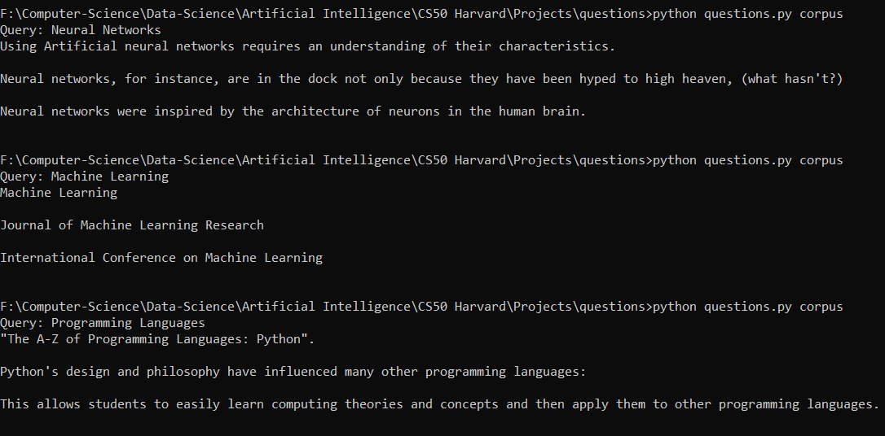
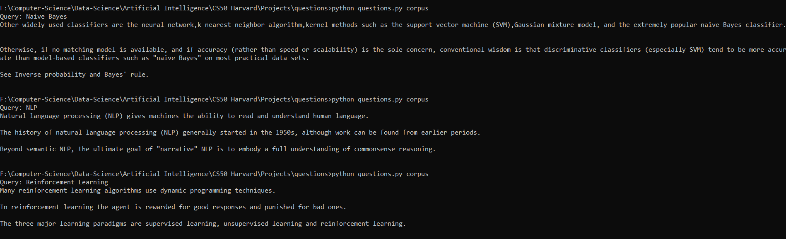

# Question Answering AI

### Answer queries, given a corpus of text by calculating the tf-idf score of the query in the corpus and return the most likely results.

## Method:

The AI takes in an corpus of text files and carries out the following actions:
<ul>
<li> A dictionary of file names matching to a list of words in the files are formed</li>
<li> Another dictionary of sentences matching to a list of words in those sentences are also formed</li>
<li> Given a query, the AI first chooses the n most likely pages ranked by the idf scores of the query.</li>
<li> From each of those pages, the AI chooses k most likely sentences for that query ranked by their tf-idf scores.</li>
<li> these sentences are returned to the user</li>
</ul>
 

> **_TF Score:_ &emsp; &emsp; TF(t,d)** = (Number of times term t appears in a document) / (Total number of terms in the document).
 

> **_IDF Score:_ &emsp; &emsp; IDF(t)** = ln(Total number of documents / Number of documents with term t in it).

>**_TF-IDF Score:_ &emsp; TF-IDF(t,d)** = TF(t,d)*IDF(t)  &emsp; &emsp; &emsp; &emsp; &emsp; &emsp; **TF-IDF(t,D)** = &#8721; (TF-IDF(t,d)) &emsp; &emsp; &#8704; d &#8712; D

 

> _Note:_ where  **d**  represents an individual document,  **t** , a wordin the query and  **D**  the entire corpus

## Outputs:

  

