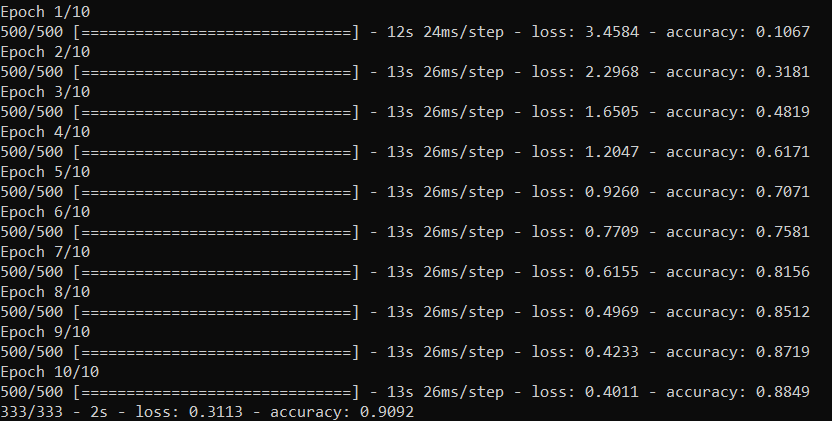

# Traffic Sign Detection

### Detect 43 different types of traffic signs using a convolutional neural network implemented in Tensorflow 2.0

## Data

The Data is available as .ppm files split according to their classes. The Images are resized, converted into numpy arrays and assigned a label.
The GTRSB(German Traffic Sign Benchmark) dataset is used which contains over 50,000 images.

  

## Results

### Validation Accuracy:
<ul>
  <li><b>10 Epochs: 90.92%</b></li>
  <li><b>30 Epochs: 96.00%</b></li>
</ul>
 

